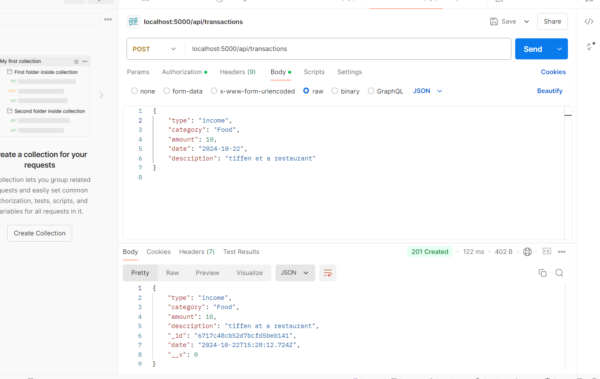
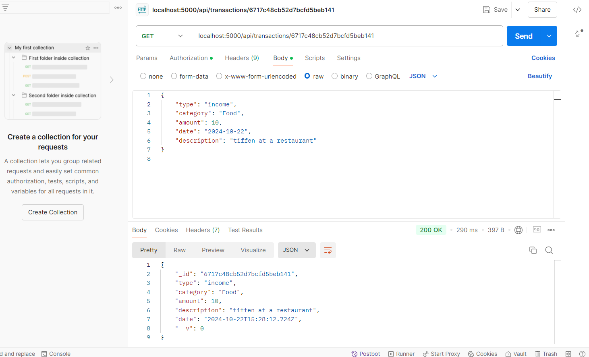
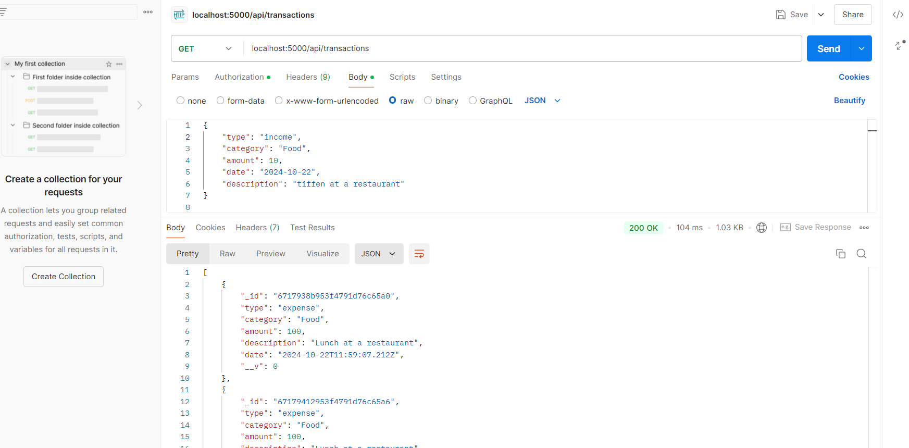
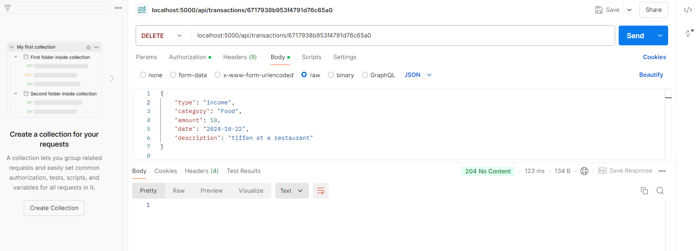

Personal Expense Tracker

Description:

The Personal Expense Tracker is a RESTful API built using Node.js and MongoDB that allows users to track their personal financial transactions, including incomes and expenses. This application provides features for adding, updating, deleting, and retrieving transactions, as well as generating a summary report.

Table of Contents
Installation
Usage
API Endpoints
Add Transaction
Get All Transactions
Get Transaction by ID
Update Transaction
Delete Transaction
Get Summary
Database Schema
Postman Collection
Screenshots
Installation
To set up the Personal Expense Tracker API locally, follow the instructions below:

Prerequisites
Node.js (version 12+)
MongoDB Atlas account or local MongoDB installation

Install dependencies:

cd expense-tracker
npm install

Create a .env file in the root directory and add your MongoDB connection string:

MONGO_URI=mongodb+srv://<username>:<password>@cluster0.f7wmb0k.mongodb.net/expenseTracker?retryWrites=true&w=majority

The server will start on http://localhost:5000. You can now use Postman or other tools to test the API endpoints.

Usage
This API provides the following functionalities:

Add a new transaction (income or expense).
Retrieve all transactions or by a specific ID.
Update or delete a transaction.
Get a summary of the user's transactions.

API Endpoints
Here’s a detailed breakdown of the available API endpoints for managing transactions. All endpoints use the base URL: http://localhost:5000/api.

1. Add Transaction
Endpoint: POST /transactions
Description: Adds a new transaction (income or expense).

###post method image

2. Get Transaction by ID
Endpoint: GET /transactions/:id
Description: Retrieves a transaction by its unique ID.

###get method image for specific id

3. Get All Transactions
Endpoint: GET /transactions
Description: Retrieves all transactions.

##get all details in the db

4. Delete Transaction
Endpoint: DELETE /transactions/:id
Description: Deletes a transaction by ID.

###delete items in the db